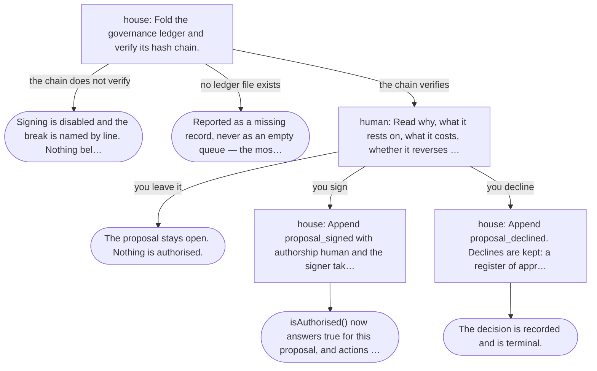
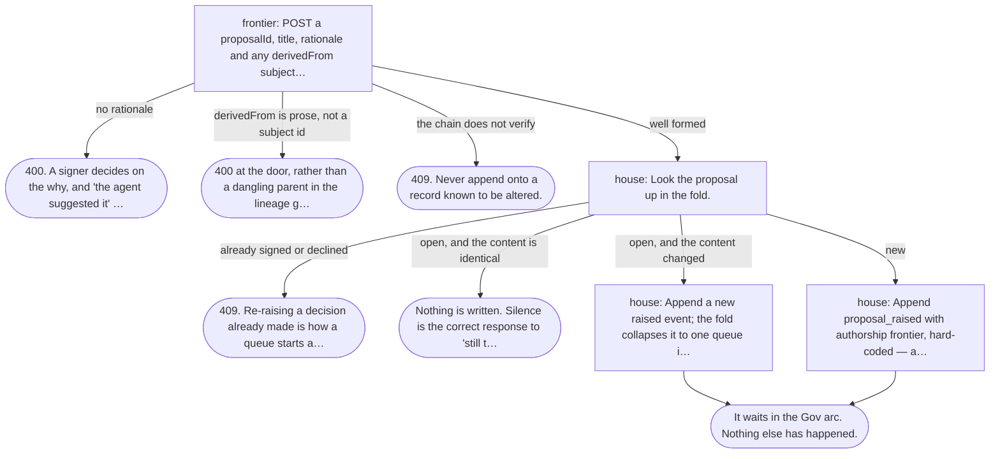
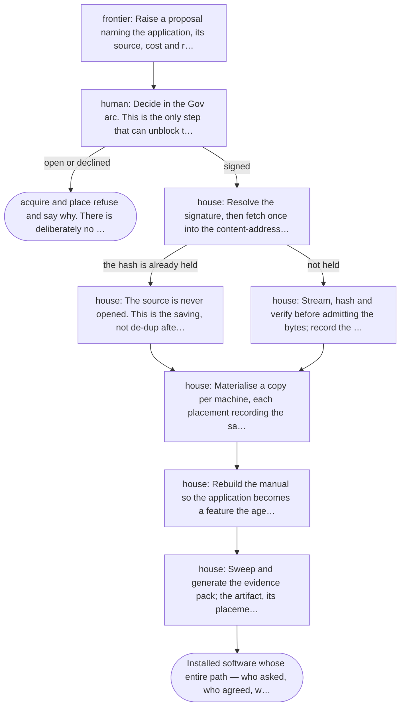
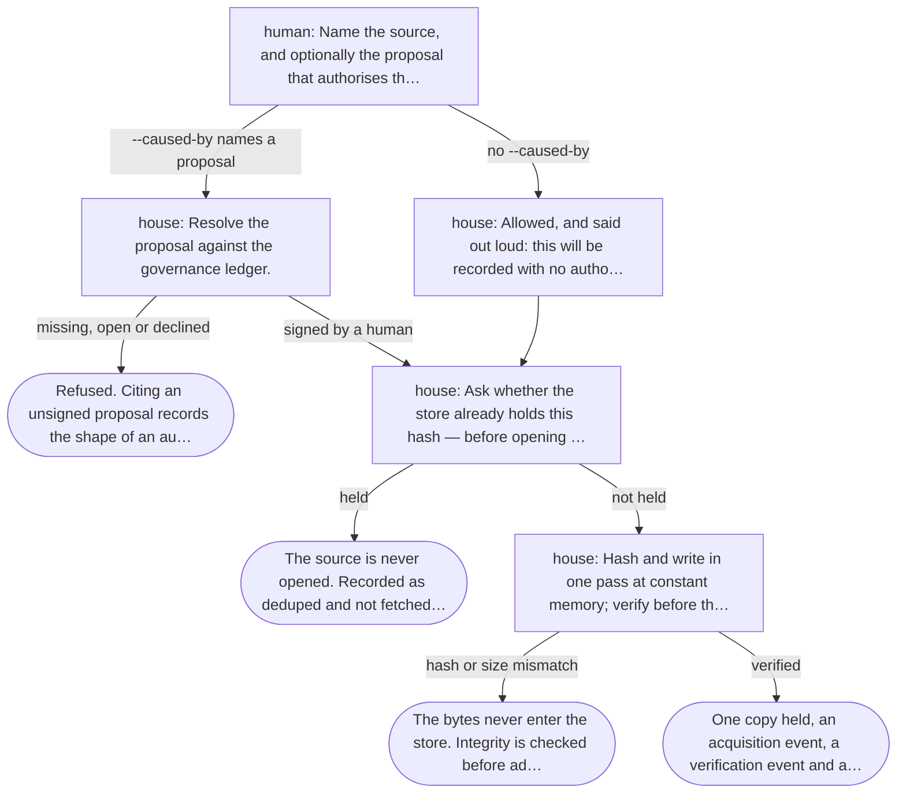
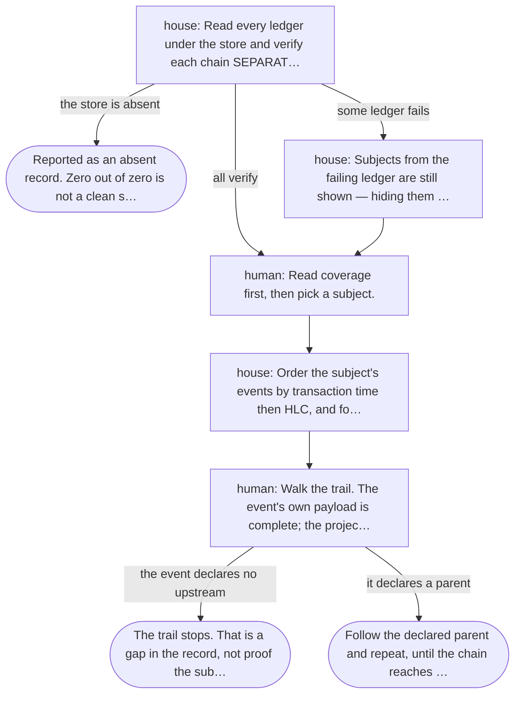
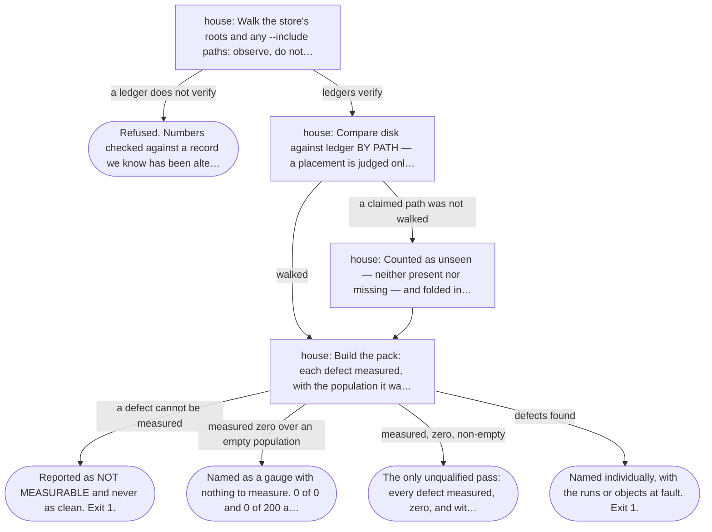
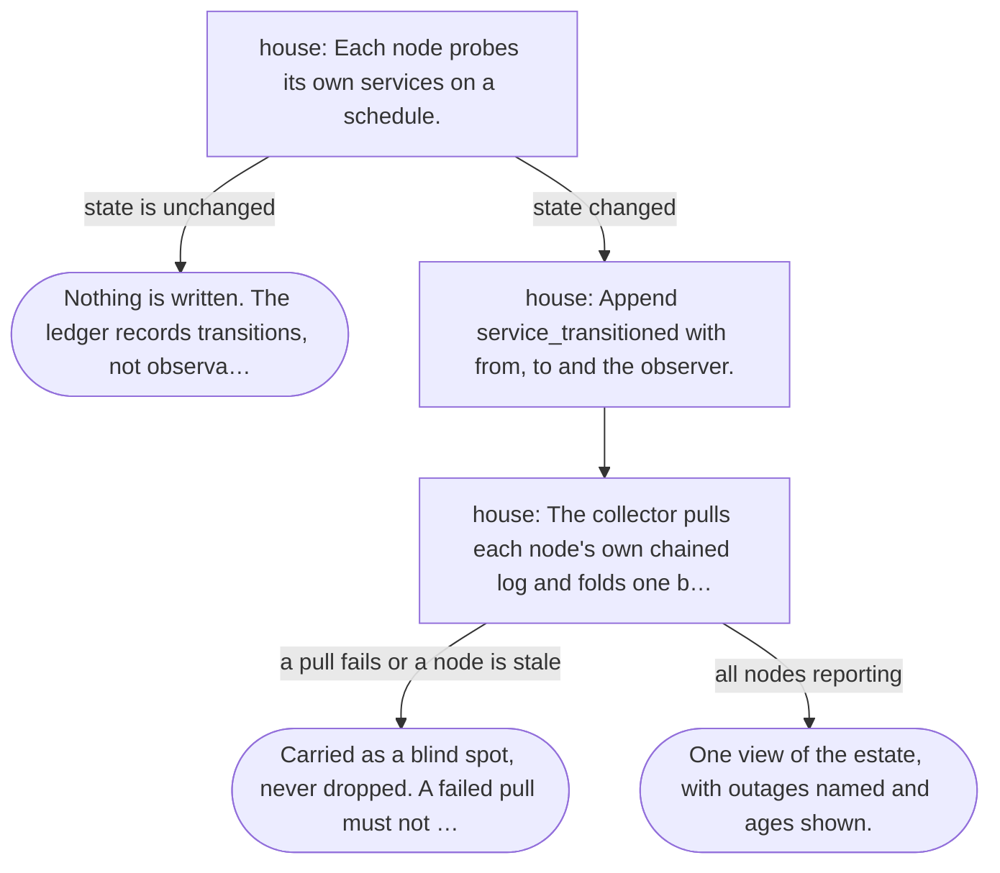
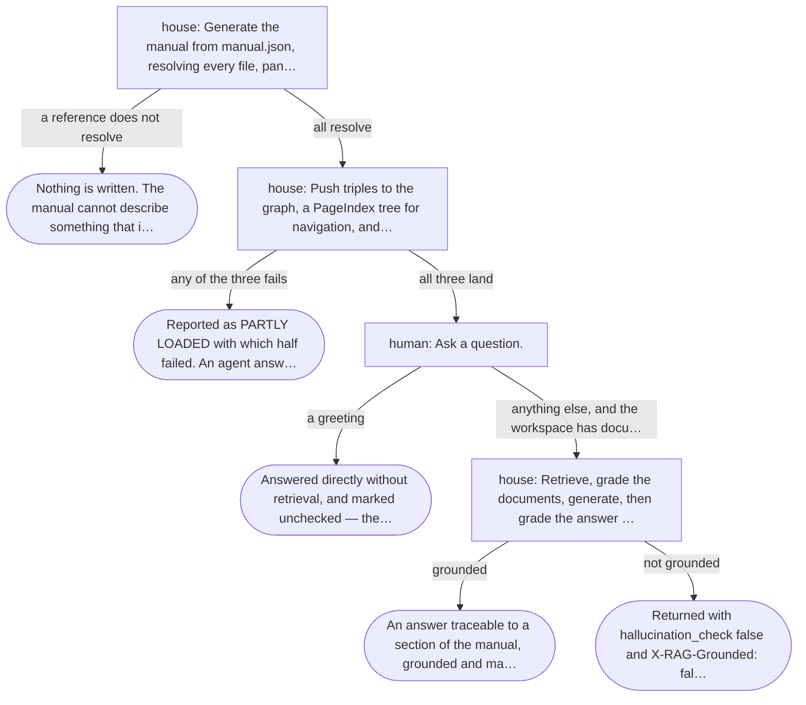
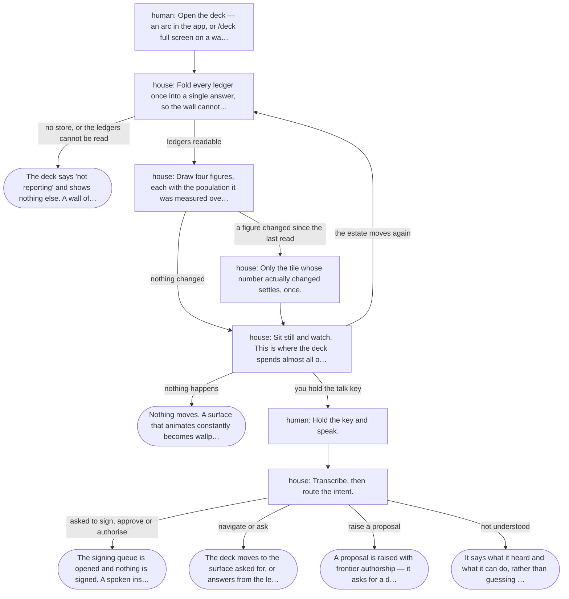

# Estate process flows

_How each governed act actually proceeds — including every way it stops_

A flow that models only the happy path documents a system nobody has. What distinguishes this estate is what it refuses, so refusals are steps here, not footnotes: each one is a real branch with a real terminal, and the build fails if a branch leads nowhere or nothing leads to it.

9 flows · 83 steps · 39 terminals, of which 15 are refusals or halts

## F-01 · Authorise a piece of work

Use cases: UC-01

| Step | Actor | What happens | Then |
| --- | --- | --- | --- |
| `queue` | house | Fold the governance ledger and verify its hash chain. | the chain does not verify → halt-chain; no ledger file exists → halt-missing; the chain verifies → review |
| `halt-chain` | — | **Signing is disabled and the break is named by line. Nothing below is evidence.** | _ends here_ |
| `halt-missing` | — | **Reported as a missing record, never as an empty queue — the most dangerous sentence this screen could say.** | _ends here_ |
| `review` | human | Read why, what it rests on, what it costs, whether it reverses — all shown before any button. | you sign → sign; you decline → decline; you leave it → open |
| `open` | — | **The proposal stays open. Nothing is authorised.** | _ends here_ |
| `sign` | house | Append proposal_signed with authorship human and the signer taken from the session, never from the request. | authorised |
| `decline` | house | Append proposal_declined. Declines are kept: a register of approvals only would imply everything proposed was accepted. | settled |
| `authorised` | — | **isAuthorised() now answers true for this proposal, and actions may cite it.** | _ends here_ |
| `settled` | — | **The decision is recorded and is terminal.** | _ends here_ |

## F-02 · Raise work for a decision

Use cases: UC-02

| Step | Actor | What happens | Then |
| --- | --- | --- | --- |
| `submit` | frontier | POST a proposalId, title, rationale and any derivedFrom subjects. | no rationale → reject-why; derivedFrom is prose, not a subject id → reject-edge; the chain does not verify → reject-chain; well formed → existing |
| `reject-why` | — | **400. A signer decides on the why, and 'the agent suggested it' is not a why.** | _ends here_ |
| `reject-edge` | — | **400 at the door, rather than a dangling parent in the lineage graph forever.** | _ends here_ |
| `reject-chain` | — | **409. Never append onto a record known to be altered.** | _ends here_ |
| `existing` | house | Look the proposal up in the fold. | already signed or declined → reject-settled; open, and the content is identical → unchanged; open, and the content changed → refresh; new → append |
| `reject-settled` | — | **409. Re-raising a decision already made is how a queue starts asking for the same signature twice.** | _ends here_ |
| `unchanged` | — | **Nothing is written. Silence is the correct response to 'still true'.** | _ends here_ |
| `refresh` | house | Append a new raised event; the fold collapses it to one queue item. | queued |
| `append` | house | Append proposal_raised with authorship frontier, hard-coded — a request is a program, never a person. | queued |
| `queued` | — | **It waits in the Gov arc. Nothing else has happened.** | _ends here_ |

## F-03 · Onboard an application

Use cases: UC-05

| Step | Actor | What happens | Then |
| --- | --- | --- | --- |
| `propose` | frontier | Raise a proposal naming the application, its source, cost and reversibility. | gate |
| `gate` | human | Decide in the Gov arc. This is the only step that can unblock the rest. | signed → acquire; open or declined → blocked |
| `blocked` | — | **acquire and place refuse and say why. There is deliberately no --force: a step that can be skipped under pressure is not a control.** | _ends here_ |
| `acquire` | house | Resolve the signature, then fetch once into the content-addressed store citing it. | the hash is already held → dedup; not held → fetch |
| `dedup` | house | The source is never opened. This is the saving, not de-dup after the fact. | place |
| `fetch` | house | Stream, hash and verify before admitting the bytes; record the acquisition and a run. | place |
| `place` | house | Materialise a copy per machine, each placement recording the same signed proposal as its cause. | remember |
| `remember` | house | Rebuild the manual so the application becomes a feature the agent knows about. | prove |
| `prove` | house | Sweep and generate the evidence pack; the artifact, its placements and its runs all carry the signature. | done |
| `done` | — | **Installed software whose entire path — who asked, who agreed, what was fetched, where it went — is provable from the ledger.** | _ends here_ |

## F-04 · Acquire an artifact once

Use cases: UC-06

| Step | Actor | What happens | Then |
| --- | --- | --- | --- |
| `cite` | human | Name the source, and optionally the proposal that authorises the fetch. | --caused-by names a proposal → verify; no --caused-by → unprovenanced |
| `verify` | house | Resolve the proposal against the governance ledger. | signed by a human → held; missing, open or declined → refuse-cite |
| `refuse-cite` | — | **Refused. Citing an unsigned proposal records the shape of an authorisation nobody gave, and afterwards it is indistinguishable from a real one.** | _ends here_ |
| `unprovenanced` | house | Allowed, and said out loud: this will be recorded with no authorisation and counted unprovenanced. Forcing a citation here would teach the operator to type a plausible id. | held |
| `held` | house | Ask whether the store already holds this hash — before opening anything. | held → skip; not held → stream |
| `skip` | — | **The source is never opened. Recorded as deduped and not fetched — transfer avoided, not transfer wasted.** | _ends here_ |
| `stream` | house | Hash and write in one pass at constant memory; verify before the atomic rename. | hash or size mismatch → reject-bytes; verified → stored |
| `reject-bytes` | — | **The bytes never enter the store. Integrity is checked before admission, not after.** | _ends here_ |
| `stored` | — | **One copy held, an acquisition event, a verification event and a run — placeable on any machine without fetching again.** | _ends here_ |

## F-05 · Prove and replay a subject

Use cases: UC-03, UC-04

| Step | Actor | What happens | Then |
| --- | --- | --- | --- |
| `fold` | house | Read every ledger under the store and verify each chain SEPARATELY — they cannot be concatenated. | the store is absent → no-store; some ledger fails → quarantine; all verify → browse |
| `no-store` | — | **Reported as an absent record. Zero out of zero is not a clean score.** | _ends here_ |
| `quarantine` | house | Subjects from the failing ledger are still shown — hiding them would lose the fact that they exist — but never counted as evidence. | browse |
| `browse` | human | Read coverage first, then pick a subject. | trail |
| `trail` | house | Order the subject's events by transaction time then HLC, and fold each prefix with the system's own projector. | step |
| `step` | human | Walk the trail. The event's own payload is complete; the projection beside it is last-write-wins and says so. | the event declares no upstream → unprovenanced-end; it declares a parent → walk-up |
| `unprovenanced-end` | — | **The trail stops. That is a gap in the record, not proof the subject had no origin.** | _ends here_ |
| `walk-up` | — | **Follow the declared parent and repeat, until the chain reaches a decision someone signed.** | _ends here_ |

## F-06 · Prove the estate to a reviewer

Use cases: UC-08

| Step | Actor | What happens | Then |
| --- | --- | --- | --- |
| `sweep` | house | Walk the store's roots and any --include paths; observe, do not judge. | a ledger does not verify → refuse-reconcile; ledgers verify → reconcile |
| `refuse-reconcile` | — | **Refused. Numbers checked against a record we know has been altered would look authoritative and mean nothing.** | _ends here_ |
| `reconcile` | house | Compare disk against ledger BY PATH — a placement is judged only if its path was actually walked. | a claimed path was not walked → unseen; walked → verdict |
| `unseen` | house | Counted as unseen — neither present nor missing — and folded into neither defect. Marking it missing would manufacture a defect out of not looking. | verdict |
| `verdict` | house | Build the pack: each defect measured, with the population it was measured over. | a defect cannot be measured → not-measurable; measured zero over an empty population → vacuous; measured, zero, non-empty → substantiated; defects found → defects |
| `not-measurable` | — | **Reported as NOT MEASURABLE and never as clean. Exit 1.** | _ends here_ |
| `vacuous` | — | **Named as a gauge with nothing to measure. 0 of 0 and 0 of 200 are the same digit and different assurances. Exit 1.** | _ends here_ |
| `defects` | — | **Named individually, with the runs or objects at fault. Exit 1.** | _ends here_ |
| `substantiated` | — | **The only unqualified pass: every defect measured, zero, and with something under it. Exit 0.** | _ends here_ |

## F-07 · Keep the estate's health honest

Use cases: UC-07

| Step | Actor | What happens | Then |
| --- | --- | --- | --- |
| `probe` | house | Each node probes its own services on a schedule. | state is unchanged → silent; state changed → transition |
| `silent` | — | **Nothing is written. The ledger records transitions, not observations.** | _ends here_ |
| `transition` | house | Append service_transitioned with from, to and the observer. | collect |
| `collect` | house | The collector pulls each node's own chained log and folds one board, citing the proposal that authorises the schedule. | a pull fails or a node is stale → blind; all nodes reporting → board |
| `blind` | — | **Carried as a blind spot, never dropped. A failed pull must not make a node vanish — absence reading as health is the failure this exists to catch.** | _ends here_ |
| `board` | — | **One view of the estate, with outages named and ages shown.** | _ends here_ |

## F-08 · Answer from the manual rather than from memory

Use cases: UC-09

| Step | Actor | What happens | Then |
| --- | --- | --- | --- |
| `build` | house | Generate the manual from manual.json, resolving every file, panel, endpoint and command it names. | a reference does not resolve → drifted; all resolve → load |
| `drifted` | — | **Nothing is written. The manual cannot describe something that is not there.** | _ends here_ |
| `load` | house | Push triples to the graph, a PageIndex tree for navigation, and chunks for retrieval. | any of the three fails → partial; all three land → ask |
| `partial` | — | **Reported as PARTLY LOADED with which half failed. An agent answering confidently from a manual it never received is worse than one that says it does not know.** | _ends here_ |
| `ask` | human | Ask a question. | a greeting → social; anything else, and the workspace has documents → retrieve |
| `social` | — | **Answered directly without retrieval, and marked unchecked — there are no documents to be grounded in.** | _ends here_ |
| `retrieve` | house | Retrieve, grade the documents, generate, then grade the answer against its sources. | grounded → answered; not grounded → flagged |
| `flagged` | — | **Returned with hallucination_check false and X-RAG-Grounded: false. The answer is not withheld; it is labelled.** | _ends here_ |
| `answered` | — | **An answer traceable to a section of the manual, grounded and marked as such.** | _ends here_ |

## F-09 · Read the estate from across the room

Use cases: UC-18

| Step | Actor | What happens | Then |
| --- | --- | --- | --- |
| `open` | human | Open the deck — an arc in the app, or /deck full screen on a wall. | fold |
| `fold` | house | Fold every ledger once into a single answer, so the wall cannot disagree with itself. | no store, or the ledgers cannot be read → notreporting; ledgers readable → draw |
| `notreporting` | — | **The deck says 'not reporting' and shows nothing else. A wall of green built from a missing store is the failure this estate exists to prevent.** | _ends here_ |
| `draw` | house | Draw four figures, each with the population it was measured over, redacted while room mode is on. | a figure changed since the last read → animate; nothing changed → waiting |
| `still` | — | **Nothing moves. A surface that animates constantly becomes wallpaper and stops being read.** | _ends here_ |
| `animate` | house | Only the tile whose number actually changed settles, once. | waiting |
| `speak` | human | Hold the key and speak. | hear |
| `hear` | house | Transcribe, then route the intent. | asked to sign, approve or authorise → refuse; navigate or ask → act; raise a proposal → raise; not understood → unknown |
| `refuse` | — | **The signing queue is opened and nothing is signed. A spoken instruction is not an authenticated act, and a room contains other voices.** | _ends here_ |
| `act` | — | **The deck moves to the surface asked for, or answers from the ledger.** | _ends here_ |
| `raise` | — | **A proposal is raised with frontier authorship — it asks for a decision and takes none.** | _ends here_ |
| `unknown` | — | **It says what it heard and what it can do, rather than guessing at a consequential verb.** | _ends here_ |
| `waiting` | house | Sit still and watch. This is where the deck spends almost all of its life. | you hold the talk key → speak; the estate moves again → fold; nothing happens → still |
