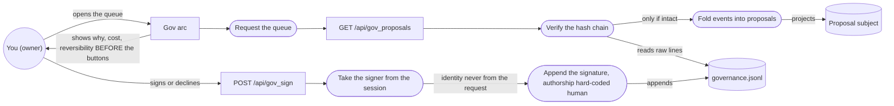
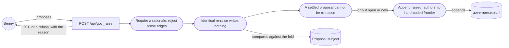
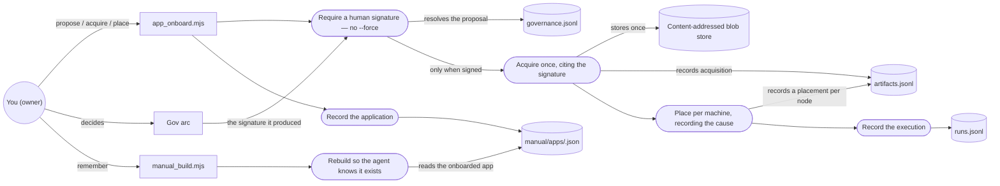
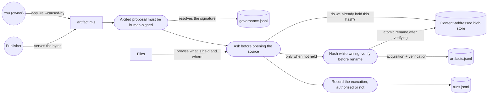
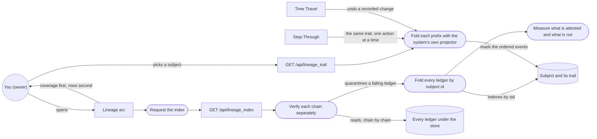
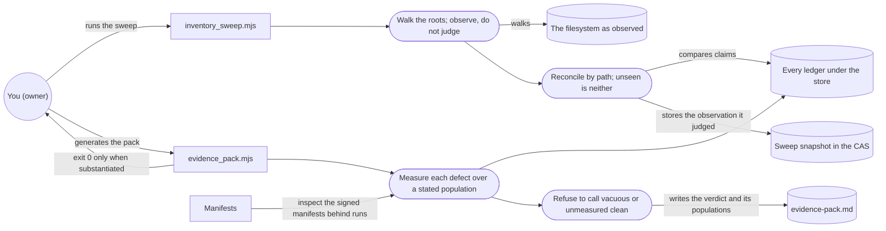
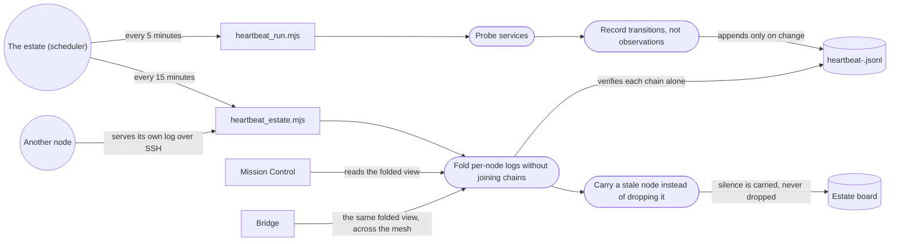
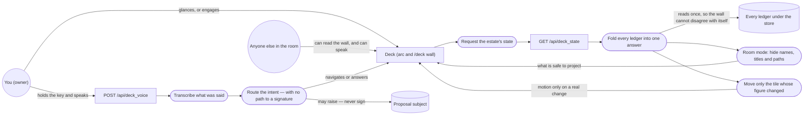

# Estate robustness diagrams

_Boundary, control and entity for every process that was actually run_

ICONIX robustness analysis has real rules, not stylistic ones: an actor may touch only a boundary, an entity may be touched only by a control, and boundaries never talk to each other or reach a store directly. A diagram that breaks them is not untidy — it describes a design where a screen writes to a ledger, or a person reaches past the interface. Those rules are enforced here, so drawing the wrong architecture fails the build.

## The four rules

| | may connect to |
| --- | --- |
| **Actor** | boundary only |
| **Boundary** | actors and controls |
| **Control** | boundaries, entities, other controls |
| **Entity** | controls only |

Anything else is a design defect the notation exists to reveal, and fails this build.

9 diagrams · 28 boundaries · 42 controls · 27 entities

## R-01 · Authorise a piece of work

Flow F-01 · use cases UC-01



**Boundary** — Gov arc · GET /api/gov_proposals · POST /api/gov_sign

**Control** — Verify the hash chain · Fold events into proposals · Take the signer from the session · Append the signature, authorship hard-coded human · Request the queue

**Entity** — governance.jsonl · Proposal subject

## R-02 · Raise work for a decision

Flow F-02 · use cases UC-02



**Boundary** — POST /api/gov_raise

**Control** — Require a rationale; reject prose edges · Identical re-raise writes nothing · A settled proposal cannot be re-raised · Append raised, authorship hard-coded frontier

**Entity** — governance.jsonl · Proposal subject

## R-03 · Onboard an application

Flow F-03 · use cases UC-05



**Boundary** — app_onboard.mjs · Gov arc · manual_build.mjs

**Control** — Require a human signature — no --force · Acquire once, citing the signature · Place per machine, recording the cause · Record the execution · Record the application · Rebuild so the agent knows it exists

**Entity** — governance.jsonl · Content-addressed blob store · artifacts.jsonl · runs.jsonl · manual/apps/<id>.json

## R-04 · Acquire an artifact once

Flow F-04 · use cases UC-06



**Boundary** — artifact.mjs · Files

**Control** — A cited proposal must be human-signed · Ask before opening the source · Hash while writing; verify before rename · Record the execution, authorised or not

**Entity** — governance.jsonl · Content-addressed blob store · artifacts.jsonl · runs.jsonl

## R-05 · Prove and replay a subject

Flow F-05 · use cases UC-03, UC-04



**Boundary** — Lineage arc · GET /api/lineage_index · GET /api/lineage_trail · Step-Through · Time Travel

**Control** — Verify each chain separately · Fold every ledger by subject id · Measure what is attested and what is not · Fold each prefix with the system's own projector · Request the index

**Entity** — Every ledger under the store · Subject and its trail

## R-06 · Prove the estate to a reviewer

Flow F-06 · use cases UC-08



**Boundary** — inventory_sweep.mjs · evidence_pack.mjs · Manifests

**Control** — Walk the roots; observe, do not judge · Reconcile by path; unseen is neither · Measure each defect over a stated population · Refuse to call vacuous or unmeasured clean

**Entity** — The filesystem as observed · Every ledger under the store · Sweep snapshot in the CAS · evidence-pack.md

## R-07 · Keep the estate's health honest

Flow F-07 · use cases UC-07



**Boundary** — heartbeat_run.mjs · heartbeat_estate.mjs · Mission Control · Bridge

**Control** — Probe services · Record transitions, not observations · Fold per-node logs without joining chains · Carry a stale node instead of dropping it

**Entity** — heartbeat-<node>.jsonl · Estate board

## R-08 · Answer from the manual rather than from memory

Flow F-08 · use cases UC-09

```mermaid
flowchart LR
  owner(("You (owner)"))
  buildCli["manual_build.mjs"]
  loadCli["manual_load.mjs"]
  agentArc["Agent arc"]
  resolveRefs(["Resolve every file, panel, route and command"])
  chunk(["Split one chunk per invariant"])
  route(["Route the question; never answer a domain question from memory"])
  ground(["Grade the answer against its sources"])
  manifest[("manual/manual.json")]
  graph[("Knowledge graph")]
  vectors[("Retrieval index")]
  tree[("PageIndex section tree")]
  llmArc["Local LLM"]
  owner -- "builds the manual" --> buildCli
  buildCli --> resolveRefs
  resolveRefs -- "reads the single source" --> manifest
  resolveRefs -- "only if everything resolves" --> chunk
  owner -- "loads it" --> loadCli
  loadCli --> chunk
  chunk -- "deterministic triples" --> graph
  chunk -- "self-contained chunks" --> vectors
  chunk -- "headings become sections" --> tree
  owner -- "asks" --> agentArc
  agentArc --> route
  route -- "reads the outline first" --> tree
  route -- "retrieves" --> vectors
  route --> ground
  ground -- "answer, labelled grounded or not" --> agentArc
  route -- "calls the served model" --> llmArc
  ground -- "grades with the same model" --> llmArc
```

**Boundary** — manual_build.mjs · manual_load.mjs · Agent arc · Local LLM

**Control** — Resolve every file, panel, route and command · Split one chunk per invariant · Route the question; never answer a domain question from memory · Grade the answer against its sources

**Entity** — manual/manual.json · Knowledge graph · Retrieval index · PageIndex section tree

## R-09 · Read the estate from across the room

Flow F-09 · use cases UC-18



**Boundary** — Deck (arc and /deck wall) · GET /api/deck_state · POST /api/deck_voice

**Control** — Fold every ledger into one answer · Room mode: hide names, titles and paths · Move only the tile whose figure changed · Transcribe what was said · Route the intent — with no path to a signature · Request the estate's state

**Entity** — Every ledger under the store · Proposal subject
