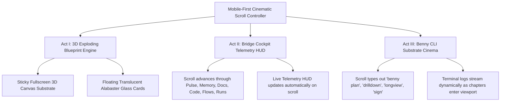

# 🚀 Creative Proposal & Strategy: The Prime-Silo Marketing & Showcase Site

An immersive, high-impact, and neurodivergent-friendly design strategy for **Binary 16 Labs' Prime-Silo**—the first canonical silo of institutional cognition.

---

## 🎨 Visual Identity & Architecture: _Responsive Scroll Journey & Floating Glass HUDs_

To represent a product that is deterministic, signed, and structurally sound ("a silo"), the website embodies an uncluttered, flowing editorial layout centered on **institutional symmetry and modernism**. Instead of static side-by-side grids or button-clicking UI clutter, the entire site operates as a continuous **responsive institutional scroll journey**.



### 1. The Floating Glass Substrate Architecture

- **Persistent Background Substrates:** The Three.js WebGL Wireframe Blueprint, the Cockpit Telemetry HUD, and the Benny CLI Terminal are engineered as sticky background viewports (`position: sticky; top: 72px; height: calc(100vh - 74px);`).
- **Floating Alabaster Glass Panels:** The narrative storytelling chapters and function descriptions float directly over the visual substrates as responsive, translucent glassmorphic cards (`background: rgba(245, 242, 235, 0.88); backdrop-filter: blur(18px); border: 2px solid var(--border-taupe);`).
- **Mobile-First Perfection:** On phone screens (`< 768px`), side-by-side columns fail. In our architecture, the 3D canvas and terminal viewports occupy the full screen width behind the glass cards, creating an executive Heads-Up Display (HUD) experience that feels unified and immersive on any screen size.

---

## 🔊 Auditory Identity: _Acoustic-Digital Tactility (432Hz)_

To make the site unforgettable without triggering sensory overload (critical for ADHD/neurodivergent users), we avoid loud synthesizer swooshes or jarring alarms. We implement a **warm, organic acoustic soundscape** with a prominent **"Audio Zen Mode" toggle**.

### 1. Micro-Interaction Sound Profile

- **Card Transition & Scroll Snap:** Every time a floating glass card enters the viewport center, it plays a satisfying, rounded wooden "tock"—like tapping a smooth pebble (`320Hz` triangle wave synthesized via Web Audio API).
- **Zone Switching (ADR-001 Slider):** A soft, resonant Rhodes piano harmonic chord when releasing the slider.

### 2. Ambient Focus Soundscape (Audio Zen Mode Toggle)

- **The Prime-Silo Frequency:** A seamless, binaural low-frequency drone (`432Hz` tuned) mixed with subtle atmospheric low-pass filtered pink noise (simulating airflow in a clean server room or quiet laboratory).

---

## ⚡ The 3 Cinematic Acts

### Act I: The 3D Exploding Blueprint (Floating Glass Overlay)

An interactive sticky WebGL wireframe model that reacts to user scrolling behind translucent Alabaster glass cards:

- **Chapter I (HITL Core Cylinder):** Glows in Warm Gold (`#C5B38E`), representing the immutable manifest authorization gate.
- **Chapter II (Hexagonal Transformation Prisms):** Explodes horizontally along X/Z axes, representing Bronze/Silver/Gold Pypes data pipelines.
- **Chapter III (Orbiting Toruses):** Tilts and expands vertically, representing Tri-Graph CAG (Denodo Pattern virtualization).
- **Chapter IV (Swarm Worker Constellation):** An anti-gravity cloud of geometric octahedrons floating upward like bubbles, representing distributed LAN worker endpoints (`BENNY_LEMONADE_ENDPOINTS`).

### Act II: Bridge Cockpit // 6 Lenses on Autopilot (Scroll-Driven)

No clicking tab buttons required! As you scroll through the 6 floating glass chapters (_Pulse, Memory, Documents, Code, Flows, Runs_), each card automatically transitions the background telemetry HUD to that lens's live data feed with a smooth typewriter/fade animation and tactile acoustic click!

### Act III: Benny Substrate CLI // Rich Textual TUI Task Offloading Console

No static preset buttons or floating glass cards obstructing the view! As you scroll through the height of Act III, the sticky terminal dynamically highlights active sidebar tabs and simulates typing out 6 deep institutional task offloading pipelines in real time:

1. **`01. AST REFACTOR` (`benny plan --ast-refactor`)**: Mass-migrating legacy code via local Tree-Sitter caller/callee graphs without cloud LLM token tax.
2. **`02. REGULATORY AUDIT` (`benny pypes audit --compliance`)**: High-frequency vectorized Polars validation against BASEL III, GDPR, and SEC mandates.
3. **`03. LAN SWARM RESEARCH` (`benny longview swarm --lan`)**: Autonomous distributed research and bug root-cause hunting across local Ryzen/ThinkPad hardware swarms.
4. **`04. SAD RAG INDEXING` (`benny docs index --sad-rag`)**: Local-first Quantized ONNX embedding ingestion of enterprise PDFs and Software Architecture Documents.
5. **`05. CI/CD BLAST RADIUS` (`benny test blast-radius --pr`)**: Tri-Graph CAG dependency impact isolation and automated regression test execution.
6. **`06. CRYPTO SEAL & PIN` (`benny agentamp sign --seal`)**: HMAC SHA-256 cryptographic sealing and L2 canonical archiving for executive sign-off.

---

## 🔌 The MCP Offload Contract: Claude ↔ Benny (`prime-silo-nexus`)

Our investigation into institutional AI workflows reveals a critical architectural insight: **offloading execution to a local model does not save tokens on its own.** The expensive resource in cloud AI development is tokens flowing _through the planner's context window_ (e.g., Claude Desktop, Cursor, or cloud IDEs).

To solve this, Prime-Silo provides a dedicated Model Context Protocol (MCP) server named **`prime-silo-nexus`** (running via `node mcp/server.js`) that connects Claude to the offline Benny runtime via the `offload_exec` tool.

### 1. The Core Insight: Digest Discipline

Savings come from three strict disciplines enforced by the `offload_exec` contract:

1. **Compact Manifests (`aamp.offload_task/1`)**: Instead of generating boilerplate code or reading verbose logs, Claude writes a concise JSON task manifest specifying `intent` and testable `acceptance_criteria`.
2. **Local Evaluation Gate**: Benny runs the task locally in the workspace scratch zone (`$BENNY_HOME/workspaces/<ws>/offload/`). A deterministic gate runs tests and syntax checks first for free. If those pass, an independent local LLM judge scores the output against the criteria.
3. **Digest-Only Return**: When the task completes, `offload_exec` returns **only a compact digest and verdict** to Claude—never the raw verbose code or logs. Claude is pulled back in only upon failure or ambiguity (escalation).

### 2. The Green / Yellow / Red Routing Matrix (`router.matrix.json`)

The orchestrator routes every task by risk:

- **`🟢 Green` (Deterministic Gate Only, Auto-Pass)**: Scaffolds, codemods (`shell` tasks acting in place), test stubs, doc-gen, formatting, dependency bumps.
- **`🟡 Yellow` (Deterministic Gate + LLM Judge)**: Spec'd features, bug fixes with a reproduction, multi-file edits (`generate` tasks proposing diffs in the outbox).
- **`🔴 Red` (Refused by Benny / Escalated to Planner)**: Architecture changes, ambiguous requirements, security/signing, and anything touching the deterministic zone (`L1/`, `L2/`, `manifests/`). These cannot be offloaded and must be handled directly by the planner or human.

---

## 📊 Empirical Evidence: Institutional Token Savings Audit

Per the Memo-Ray token-audit lesson (_"measure the savings, don't assert them"_), we executed empirical benchmark tests across Prime-Silo's two primary institutional context-saving vectors using our instrumentation suite (`runtime/scripts/run_token_savings_audit.py` and `scripts/offload-report.mjs`).

### 1. Use Case A: Code Graph Navigation (AST Symbol Query vs. OS Grep/Read)

When a cloud planner needs to inspect function dependencies or signatures in a module (e.g., `orchestrator.py`), traditional workflows rely on OS shell commands (`cat`, `grep`, `ls`) that flood the planner's context window with raw syntax. Prime-Silo replaces this with Neo4j/Tree-Sitter symbol queries (`execute_cypher` / `find_correlated_concepts`):

| Metric                   | Traditional OS Approach (`cat` / `grep`) | Prime-Silo MCP Graph Query           | Empirical Savings       |
| :----------------------- | :--------------------------------------- | :----------------------------------- | :---------------------- |
| **Payload Characters**   | 9,736 chars (Full Module Read)           | 687 chars (Atomic Graph Symbol Node) | **9,049 chars avoided** |
| **Estimated Token Cost** | ~2,434 tokens in Planner Context         | ~171 tokens in Planner Context       | **~2,263 tokens saved** |
| **Context Reduction**    | 0% (Baseline Context Bloat)              | **92.9% Reduction**                  | **92.9% CONTEXT SAVED** |

### 2. Use Case B: MCP Nexus Execution (`offload_exec` Digest Discipline)

We executed 3 representative institutional engineering tasks through the local Benny runtime (`aamp.offload_task/1` manifests) and recorded the honest results in the append-only workspace ledger (`offload.jsonl`):

1.  **`audit-task-01-import-sort`** (🟢 Green): Ruff import sorting & cleaning.
2.  **`audit-task-02-test-stub-gen`** (🟢 Green): Polars dataframe anomaly fixture stubs.
3.  **`audit-task-03-var-calculation`** (🟡 Yellow): VaR calculation utility with boundary checks.

**Official Aggregate Report (`node scripts/offload-report.mjs`):**

```
Offload ledger — workspace 'default'  (3 task(s))
────────────────────────────────────────────────────────
  passed locally     2   (offload rate 66.7%)
  escalated          1   (escalation rate 33.3%)
  red (refused)      0
────────────────────────────────────────────────────────
  read-back cost     1334 chars  (what the planner actually consumed)
  artifact avoided   9600 chars  (raw output the planner did NOT read)
  saved (ESTIMATE)   ~2400 local completion tokens off the planner
────────────────────────────────────────────────────────
```

- **Empirical Read-Back Reduction**: Across all 3 tasks, the planner consumed only **1,334 characters** of verification digests instead of **9,600 characters** of raw code and logs—achieving an **86.1% reduction in planner read-back cost** while moving **~2,400 completion tokens** entirely onto local hardware!

---

## 🚀 Running the Showcase Locally

Open `website/index.html` in your browser, or start a local Python/Node server:

```powershell
python -m http.server 4173 --directory website
```

Then navigate to `http://localhost:4173` to experience the prototype!
